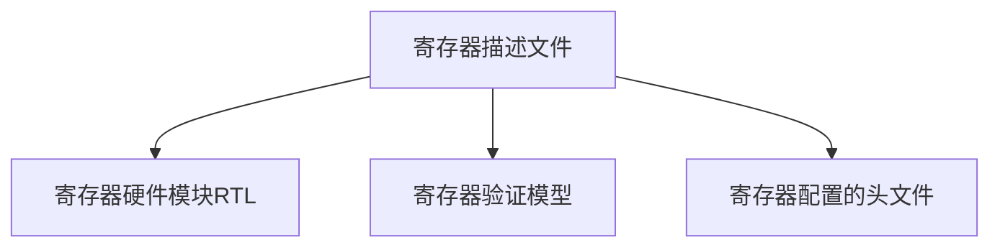

## gen_apb_file

## 目录
  - [背景](#背景)
  - [描述](#描述)
  - [安装](#安装)
  - [用法](#用法)
  - [维护者](#维护者)
  - [如何贡献](#如何贡献)
  - [参考](#参考)
  - [许可证](#许可证)
## 背景
SOC芯片中绝大部分功能模块都有寄存器,处理器通过对寄存器的读写,实现对模块状态的获取和功能的配置。硬件工程师、验证工程师、软件工程师都需要与寄存器打交道,需要有一份中心化[[1]](#refer-anchor-1)且可读性强的寄存器描述文件作为依据,以制作寄存器硬件模块、寄存器验证模型、寄存器配置的头文件。而手动制作消耗时间,且容易出错。

## 描述
gen_apb_file为一种开源的寄存器文件解决方案,包括中心化的寄存器描述文件(Excel格式)和相应的寄存器文件生成脚本,能够快速生成用于寄存器硬件模块、ralf模型、c语言头文件。主要有以下特性:

- 支持APB接口类型
- 寄存器位宽可配
- 支持25种寄存器存取类型[[2]](#refer-anchor-2)(见下表)
- 可生成verilog
- 可生成ralf
- 可生成c header
- 支持多个模块

尚待改进的地方如下:
- 未支持语义检查
- c header未包括域的信息

|NO |ACCESS |DESCRIPTION|
|---|---|---| 
1|RO|读写此域都无影响|
2|RW|会尽量写入,读取时对此域无影响|
3|RC|写入时无影响,读取时会清零|
4|RS|写入时无影响,读取时会设置所有的位|
5|WRC|尽量写入,读取时会清零|
6|WRS|尽量写入,读取时会设置所有的位|
7|WC|写入时会清零,读取时无影响|
8|WS|写入时会设置所有的位,读取时无影响|
9|WSRC|写入时会设置所有的位,读取时会清零|
10|WCRS|写入时会清零,读取时会设置所有的位|
11|W1C|写1清零,写0时无影响,读取时无影响|
12|W1S|写1设置所有的位,写0时无影响,读取时无影响|
13|W1T|写1入时会翻转,写0时无影响,读取时无影响|
14|W0C|写0清零,写1时无影响,读取时无影响|
15|W0S|写0设置所有的位,写1时无影响,读取时无影响|
16|W0T|写0入时会翻转,写1时无影响,读取时无影响|
17|W1SRC|写1设置所有的位,写0时无影响,读清零|
18|W1CRS|写1清零,写0时无影响,读设置所有位|
19|W0SRC|写0设置所有的位,写1时无影响,读清零|
20|W0CRS|写0清零,写1时无影响,读设置所有位|
21|WO|尽可能写入,读取时会出错|
22|WOC|写入时清零,读取时出错|
23|WOS|写入时设置所有位,读取时会出错|
24|W1|在复位（reset）后,第一次会尽量写入,其他写入无影响,读取时无影响|
25|WO1|在复位后,第一次会尽量写入,其他的写入无影响,读取时会出错|

## 安装
依赖python及xlrd
- `sudo apt-get install python`
- `pip install xlrd`

## 用法
- `python gen_apb_file.py template.xls`

## 维护者
[@wudayemen](https://www.cnblogs.com/wudayemen/)
## 如何贡献
 [Open an issue](https://github.com/wudayemen/gen_apb_file/issues) or submit PRs.
## 参考

[1] [参考路科验证文章](http://blog.eetop.cn/blog-1561828-6266218.html)

[2] [参考 &laquoUVM实战&raquo p512]

## 许可证
The gen_apb_file.py is using the LGPL license. That's for the formalities. But there are some practical statements implied by those licenses:

Your freedoms are:

- You can use gen_apb_file.py in your closed/commercial projects.
- The generated RTL is yours (.v files)
- The generated RALF is yours (.ralf files)
- The generated C HEADER is yours (.h files)

Your obligations (and my wish) are:

- f you modify the gen_apb_file.py , please, share your improvements.
Also, gen_apb_file is provided "as is", without warranty of any kind.
